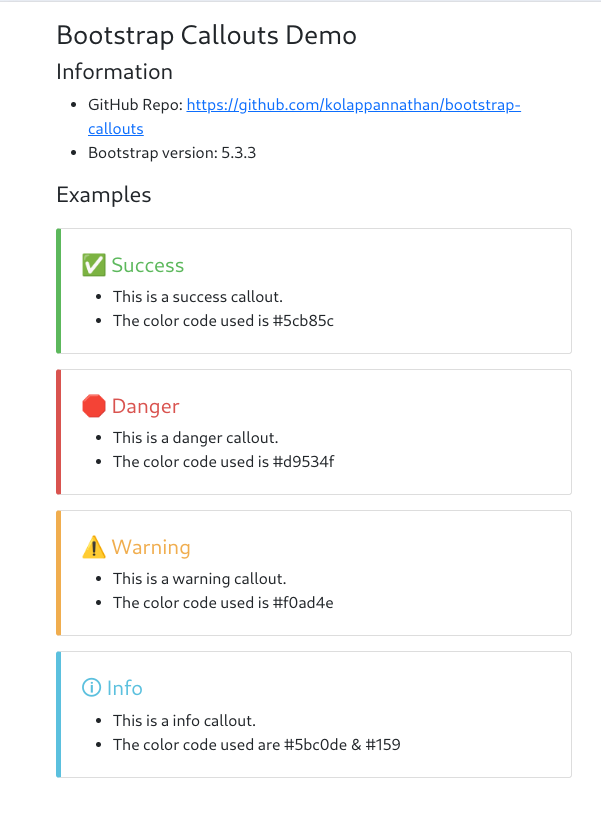
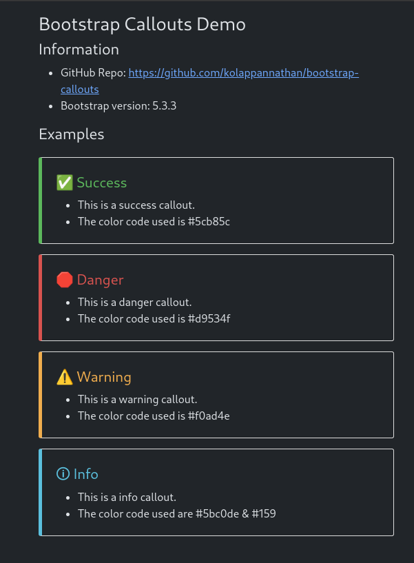

# Bootstrap Callouts

A simple callouts for use in Bootstrap 5 websites.

 - **Live Demo**: https://kolappannathan.github.io/bootstrap-callouts/
 - **Bootstrap Version**: 5.0.1

### Sample Screenshots

*Light mode*



*Light mode*



### Usage

 1. Include the bs-callout.css in your site's CSS
 2. Here is an example HTML code
 ```HTML
<div class="bs-callout bs-callout-success">
    <div class="bs-callout-heading">
        ✅ Success
    </div>
    <ul class="mb-0">
        <li> This is a success callout. </li>
        <li> The color code used is #5cb85c </li>
    </ul>
</div>
 ```

### Type of Callouts

As seen in the screenshot there are 4 types of callouts. 
 1. Success
 2. Danger
 3. Warning
 4. Info
